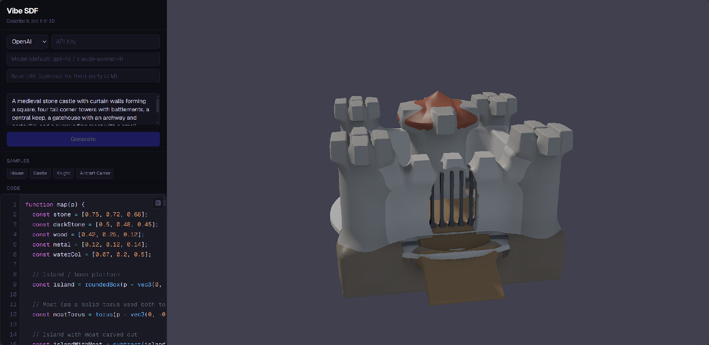
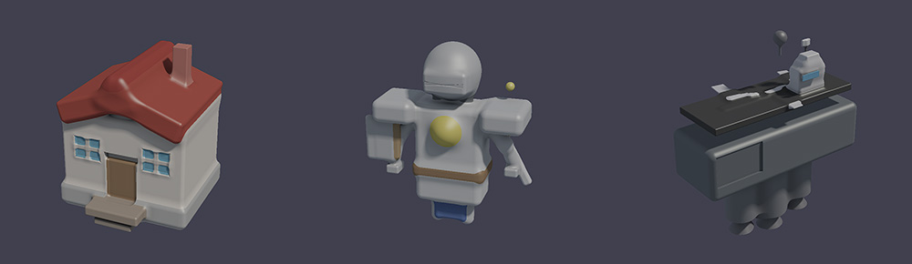

# vibe-sdf

Generate 3D SDF models from natural language using LLMs, rendered in real-time with WebGL ray marching.



## How It Works

```
Prompt → LLM (GPT-4 / Claude) → JS SDF DSL → GLSL Transpiler → Ray Marching Shader → WebGL
```

Describe a 3D shape in plain English. The LLM generates SDF code in a JavaScript DSL, which is transpiled to GLSL and rendered instantly via ray marching.

## Features

- **LLM-powered 3D generation** — Supports OpenAI and Anthropic providers
- **Custom SDF DSL** — Primitives (sphere, box, torus, capsule, cylinder, cone), CSG operations (union, subtract, intersect), smooth blending, spatial transforms
- **Real-time WebGL rendering** — Ray marching with soft shadows, ambient occlusion, and multi-light setup
- **Live code editor** — Syntax highlighting, line numbers, instant preview on edit
- **Sample gallery** — Built-in examples: house, castle, knight, aircraft carrier
- **Robust generation** — Agentic retry loop validates and re-prompts on transpilation errors

## Sample Gallery



## Tech Stack

- **Next.js** + **React** + **TypeScript**
- **Three.js** / WebGL for rendering
- **Vercel AI SDK** for LLM integration
- **Babel parser** for AST-based JS → GLSL transpilation
- **Tailwind CSS**

## Getting Started

```bash
npm install
npm run dev
```

Open [http://localhost:3000](http://localhost:3000), enter your API key (OpenAI or Anthropic), and describe a shape.

## License

MIT
